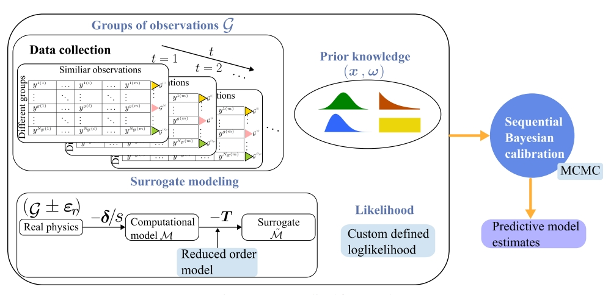

# Companion code and data for the work "Multi-Source Data Integration for Soil Parameter Uncertainty Quantification"

  This repository contains the MATLAB based implementation of the PCA-PCE reduced order modelling， sequential Bayesian calibration, multiple source data information fusion. 
  
  Please cite this work, in case you find this wokr useful to you.

--------------------
# Table of Contents
<!-- TOC depthFrom:2 depthTo:4 withLinks:1 updateOnSave:1 orderedList:0 -->
- [Overview](#Overview)
- [System Requirements](#Requirements)
- [Instructions](#Instructions)
- [Contact](#Contact)
<!-- /TOC -->
---------------------
# Overview 
This code is a companion to an academic research paper. If you use this work in an academic context, please cite the following publication(s):

  @article{yang2025,
    title={Multi-Source Data Integration for Soil Parameter Uncertainty Quantification},
    author={Yang, Ningxin and Le, Truong and Potts, David M and others},
    journal={arXiv preprint arXiv:2407.11600},
    year={2024}
  }

**Keywords:** Sequential Bayesian inversion; Uncertainty quantification; Reduced-order-modelling; Model discrepancy; Multi-source data

This folder contains code and data to reproduce the results in the associated paper. In particular, the provided scripts will reproduce all graphs.

Open main.mlx file using MATLAB
## step 1
change your working path to `...\SBI\RUN`;

add your UQlab package core path `...\UQlab\UQLab_Rel2.0.0\UQLab_Rel2.0.0\core`;

add your subroutine code path `...\SBI\Main\subroutines`;

Run Matlab;

## step 2
Cases A, B, C are cases using different source of observations:A - only pile displacement; B - only reaction force, or C - both. 

To change between cases, we just need to change the data we used, and all the input data are put in the folder "input/csv/..."

Case A: Copy the data from folder "Cases/CaseA" to the current path "input/csv/..."; 

Case B: Copy the data from folder "Cases/CaseB" to the current path "input/csv/..."; 

Case C: Copy the data from folder "Cases/CaseC" to the current path "input/csv/..."; 

Also we need to change the weight for the model discrepancy, we just need to change the data we used, and all the input data are put in the folder "input/mat/..."

Case A: Copy the data from folder "Cases/CaseA" to the current path "input/mat/..."; 

Case B: Copy the data from folder "Cases/CaseB" to the current path "input/mat/..."; 

Case C: Copy the data from folder "Cases/CaseC" to the current path "input/mat/..."; 

## step 3
click run

---------------------
# Requirements 
The following functions used in the scripts require toolboxes to be installed:
1. UQLab packages for MCMC https://www.uqlab.com/
2. Matlab 2024 (HPC also supported)
3. Statistics and Machine learning toolbox;Optimization toolbox;Global Optimization toolbox

---------------------
## Contact 
Thank you very much for your interest in our work. All the data and figures in the paper are intended to be as reproducible as possible. If you encounter any issues using the code, please don't hesitate to reach out.

Ningxin Yang

n.yang23@imperial.ac.uk